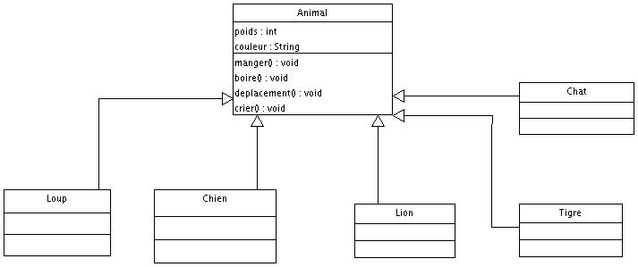
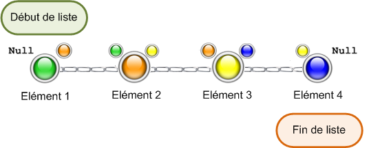

# Useful links

[Buld Java Web Apps with Vs Code](https://code.visualstudio.com/docs/java/java-tutorial)
[Main Java extensions for Vs Code](https://github.com/Microsoft/vscode-java-pack)
[Presentation of RedHat extension Java](https://github.com/redhat-developer/vscode-java)

## Classes abstraites et interfaces

Concepts permettant de bien structurer des programmes

### Classes abstraites

- Nous ne pouvons pas instancier une classe abstraite

- Exemple montrant l'utilité de ces classes : soit un programme qui gère différents types d'animaux (loups, chiens, chats, lions, tigres). Tous ces animaux ont des points communs. Nous pouvons créer une classe mère "Animal". On se retrouve avec la hiérarchie suivante :

Cependant si l'on instancie un object Animal

    public class Test{
        public static void main(String[] args){
            Animal ani = new Animal();
            ani.manger(); //Que doit-il faire ?
       }
    }

Cela ne rime à rien d'appeler la méthode `manger()` avec une instance de Animal. En effet on ne sait pas précisément ce qu'un animal mange.

D'où l'idée de faire de la classe Animal une classe abstraite.

- Les classes abstraites permettent de définir une superclasse.

- Elles sont déclarées avec le mot-clé `abstract`.

- Les enfants d'une classe abstraite peuvent utiliser tous ses éléments (méthodes et attributs déclarés `public` ou `protected`).

- Possibilité de définir dans ces classes abstraites, des méthodes abstraites. Ces méthodes n'auront pas de corps. Il s'agit jsute d'un en-tête et se termine donc par un `;`. Ces méthodes ne peuvent exister que des dans des classes abstraites.

- Les classes héritant d'une classe abstraite devront (OBLIGATOIRE) implémenter les méthodes abstraites de leur mère comme bon leur semble.

### Les interfaces

- Les interfaces permettent de créer des supertype.

- Les interfaces sont des classes 100% abstraites.

- On n'utilise pas le mot-clé `abstract` dans des interfaces.

- Pour qu'une classe utilise une interface, on utilise le mot-clé `implements`

    public interface I{
        public void A();
        public String B();
    }

    public interface I2{
        public void C();
        public String D();
    }

    public class X implements I, I2{
        public void A(){
          //…
        } 
        public String B(){
          //…
        } 
        public void C(){
          //…
        } 
        public String D(){
          //…
        }
    }

- Lorsque qu'on implémente une classe, on doit obligatoirement redéfinir toutes les méthodes de l'interface.

#### Notes

Le polymorphisme nous permet ceci :

    public static void main(String[] args){
        //Avec cette référence, vous pouvez utiliser les méthodes de l'interface I
        I var = new X();
        //Avec cette référence, vous pouvez utiliser les méthodes de l'interface I2
        I2 var2 = new X();
        var.A();
        var2.C();
    }

### Le pattern strategy

- L'héritage atteint ses limites quand nous devons modifier la hiérarchie des classes.

- Le pattern strategy est basé sur l'encapsulation.

- Consiste à créer des objets avec des données, des méthodes (voire les deux). Le principe de base de ce pattern est "isoler ce qui varie dans votre programme et encapsulez-le".

- Préférez encapsuler des comportements plutôt que de les mettre d'office dans l'objet concerné.

## Java 8 ou la révolution des interfaces

### Des méthodes statiques

- Possibilité de définir des méthodes statiques (via le mot-clé `static`) dans des interfaces. De plus on peut implémenter de telle méthode dans ces mêmes interfaces.

- Pour appeler ces méthodes, on n'instancie pas ces interfaces. On utilise `nom_interface.nom_methode_statique()`.

- Des interfaces peuvent avoir une interface mère. L'héritage a donc été introduit dans les interfaces.

### Des méthodes par défaut

- On peut ajouter un comportement par défaut à des méthodes dans une interface, via le mot-clé `default`.

- Rajouter une méthode dans une interface voulais dire, avant Java 8 et les méthodes par défaut, repasser sur toutes les classes qui implémentent l'interface afin de redéfinir la nouvelle méthode : ce n'est plus la peine maintenant.

## Exceptions

### Bloc try...catch

- Bloc try...catch pour capturer des execeptions

- getMessage() de la classe Exception, nous permet de préciser la nature de l'erreur.

- le bloc finally permet de définir des actions à effectuer qu'il y est une exception où qu'il n'y en ait pas.

### Exceptions personnalisées

- Il faut créer une classe héritant de la classe Exception, une telle classe doit se terminer par `Exception`. Elle doit renvoyer et gérer l'exception.

- `throws` signale à la JVM qu'un morceau de code, une méthode, une classe, ... est potentiellement dangereux et qu'il faut utiliser un bloc `try...catch`. throws est suivi du nom de la classe qui va gérer l'exception.

- `throw` permet de lever une exception manuellement en instanciant un objet de type Exception (ou un objet hérité).

- Exemple avec la classe Ville et l'exception NombreHabitantException.

- Il faudra obligatoirement gérer les exceptions custom avec des blocs `try...catch` sinon le code ne compilera pas.

- On peut évidemment utiliser des méthodes de la classe Exception avec la classe exception fille.

- Pour les classes filles héritant d'une classe levant une exception via l'une de leurs méthodes. Il faut propager cette exception dans a classe fille. Voir second constrcuteur de la classe Capitale.
 
- Nous ne pouvons pas faire de `try...catch` avec un super (constructeur) à l'intérieur.

### La gestion de plusieurs exceptions

- L'ordre des blocs `catch` a son importance.

### Java 7 le multi-catch

- Possibilité de catcher plusieurs exceptions dans un seul catch via l'opérateur `|`

    //Gestion de plusieurs exceptions différentes
    catch (NombreHabitantException | NomVilleException e2){
        System.out.println(e2.getMessage());
    }

## Les énumérations

- Les énumérations se déclarent comme une classe

    public enum Langage {
        JAVA,
        C,
        CPlus,
        PHP;
    }

- C'est comme si nous avions 4 objets (JAVA, C, CPlus, PHP) partageant tous les mêmes méthodes issues de la classe java.lang.Object come n'imorte quel autre objet.

- Les enumérations héritent de la classe java.lang.Enum.

- Il n'y a pas de déclaration de portée, ni de type: les énumérations se comportent comme des variables statiques déclarées `public`.

- On écrira Langage.JAVA

- La méthode `values()` permet de retourner la liste des déclarations de l'énumération.

- la méthode `toString()` retourne le nom de l'objet défini dans l'énumération.

- On peut définir un constructeur dans une énumération. Ce constructeur n'a pas de portée, il est toujours considérée comme `private` afin de préserver les valeurs définies dans l'enum.

## Les collections d'objets

- Les collections se trouvent dans le package `java.util`

### Les différents types de collections

- Les collections sont des interfaces encapsulant la majeure partie des méthodes utilisables avec toutes les implémentations concrètes.

- les objets List servent à stocker des objets sans conditions particulières sur la façon de les stocker. Acceptent toutes les valeurs, même les valeurs null.

- Les types Set n'autorisent pas deux fois la même valeur (le même objet), ce qui est pratique pour une liste d'éléments uniques.

- Les Map fonctionnent avec un sytème de clé.

### Les objets List

- Les objets appartenant à la catégorie List sont des tableaux extensibles à volonté.

- On y trouve les `Vector`, `LinkedList`, `ArrayList`

- On récupère les éléments de la liste via leur indice.

- Implémentent l'interface `Iterator`. Objet qui a pour rôle de parcourir une collection.

#### LinkedList (liste chaînée)

- Liste dont chaque élément contient une référence à l'élément précédent et une référence à l'élément suivant.

- Inadaptée pour des collections avec beaucoup d'objets.

- Utile si l'on souhaite ajouter ou supprimer des éléments en milieu de liste.

#### ArrayList

- Nous pouvons metter tout ce que nous voulons dans une ArrayList, même null.

- Célèbres méthodes ArrayList : `add()`, `get(int index)`, `remove(int index)`, `isEmpty(int index)`, `removeAll()`, `contains(Object element)`

- Rapide en lecture contrairement aux LinkedList.

- Plus lente que les LinkedList pour ajouter des éléments en milieu de liste.

### Les objets Map

- Fonctionne avec un couple clé-valeur

- On y trouve `HashTable`, `HashMap`, `TreeMap`, `WeakHashMap`, ...

- la clé qui sert à identifier une entrée dans notre collection est unique.

- Une valeur peut être associé à plusieurs clés.

- Plus la Map contiendra de valeurs, plus elle sera lente et lourde (normal car stocke une valeur supplémentaire que les autres collections, la clé).

#### HasTable (table de hachage)

- On le parcourt grâce à ses clés via la classe `Enumeration`.

- Célèbres méthodes HashTable : `isEmpty()`, `contains(Object value)`( ou `containsValue(Object value)`), `containsKey(Object key)`, `put(Object key, Object value)`, `elements()`, `keys()`.

- Un objet `HashTable` n'accepte pas la valeur `null`.

- un objet `HashTable` est thread safe, c'est-à-dire qu'il est utilisable dans plusieurs threads simultanément sans qu'il y ait un risque de conflit de données.

#### HasMap

- Quasiment identique à `HashTable`.

- Accepte la valeur `null`.

- Il n'est pas thread safe.

### Les objets Set

- Collection qui n'accepte pas les doublons.

- On y trouve : `HashSet`, `TreeSet`, `LinkedHashSet`, ...

- Certains `Set` n'acceptent pas la valeur `null` ou certains types d'objets.

- Adaptés pour manipuler une grande quantité de données. Mais peu baisser en performance au niveau des insertions. `HashSet` privilégié. Si on veut souvent trier la collection mieux utiliser un `TreeSet`.

#### HashSet

- On peut le parcourir avec un objet `Iterator` ou extraire de cet objet un tableau d'Object.

- Célèbres méthodes HashSet : `add()`, `isEmpty()`, `contains(Object value)`, `iterator()`,  `remove(Object o)`,  `toArray()`.

## La généricité en Java

- Faire des classes qui n'acceptent qu'un certain type d'objets ou de données de façon dynamique.

### Principe de base

- Une fois instancié avec un type, l'objet ne pourra travailler qu'avec ce type de données.

- Exemple d'une instanciation:

    public static void main(String[] args) {
        Solo<Integer> val = new Solo<Integer>(12);
    int nbre = val.getValeur();
    }

- On peut bien sur instancier autant d'objet Solo avec un d'autre type générique.

    public static void main(String[] args) {
        Solo<Integer> val = new Solo<Integer>();
        Solo<String> valS = new Solo<String>("TOTOTOTO");
        Solo<Float> valF = new Solo<Float>(12.2f);
        Solo<Double> valD = new Solo<Double>(12.202568);
    }

- Possibilité de définir des classes génériques prenant deux types, voir classe Duo.java.

#### Notes

- Lorsque on déclare une variable de type primitif on peut utiliser ses classes enveloppes (exemple Integer est la classe enveloppe de int) et ainsi profiter des méthodes de la classe Object.

- Depuis Java 5, nous avons l'autoboxing permettant de transformer automatiquement un type primitif en classe wrapper (c'est le boxing) et inversement (c'est l'unboxing)

- Exemple :

    public static void main(String[] args){ 
        int i = new Integer(12);         //Est équivalent à int i = 12
        double d = new Double(12.2586);  //Est équivalent à double d = 12.2586
        Double d = 12.0;
        Character c = 'C';
        al = new ArrayList();
        //Avant Java 5 il fallait faire al.add(new Integer(12))
        //Depuis Java 5 il suffit de faire
        al.add(12);
        //…
    }

### Généricité et collections

- Possibilité d'utiliser la généricité sur des objets servant à gérer des collections.

#### Héritage et généricité

- Pas possible qu'une liste de type mère recoive une liste de type fille (listMere = listFille).

- Le `wildcard`, ou le symbole `?` permet de déclarer une collection acceptant n'importe quel type d'objet.

- Pour qu'une List, ArrayList puisse avoir les instances d'une classe mère mais également de ses classes filles nous pouvons écrire le code suivant :

    //List n'acceptant que des instances de Voiture ou de ses sous-classes
    List<? extends Voiture> listVoitureSP = new ArrayList<VoitureSansPermis>();

- Ce type d'idée est très intéressant pour définir des méthodes génériques